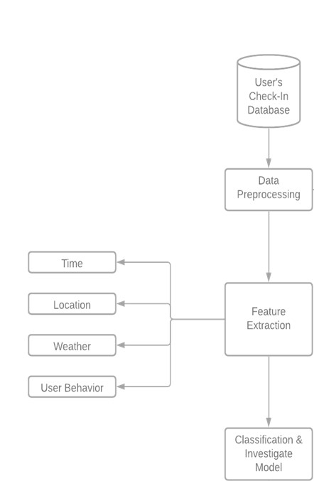
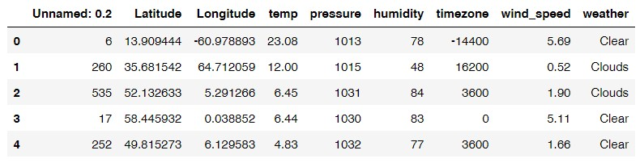
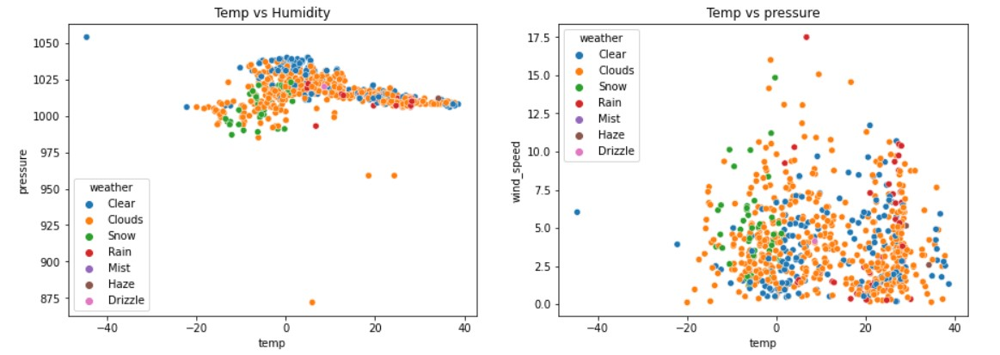
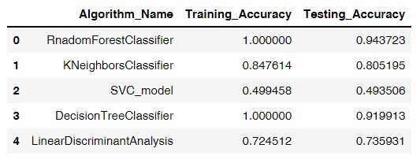

# Weather-classification-using-machine-learning
Weather classification is a machine learning project in which we predict the weather of different place in the world according to randomly selection of longitude and latitude. For to classification purpose we use 5 classification algorithm for this purpose. This is a complete project and Architecture diagram is also included. 

### Architecture Diagram

Architectural diagram is explaining the different sections of the proposed system initial step is getting relevant dataset, after that, the available dataset will be passed through the most important procedure of data preprocessing, this phase requires most of the time and because it’s extremely essential so without refining data, the proposed model will not work as expected so preprocessing will be necessary after preprocessing different feature selection algorithms will be utilized after successful selection of features different association mining algorithms and the state of the art data mining techniques with existing corpora will be applied and after successful evaluation of results advancement and future work will be proposed.

### Features 

### Visual representation of Data

### Classification 
We use 5 machine learning algorithm. Their Accuracy table is also included.

For any query feel free to contact
